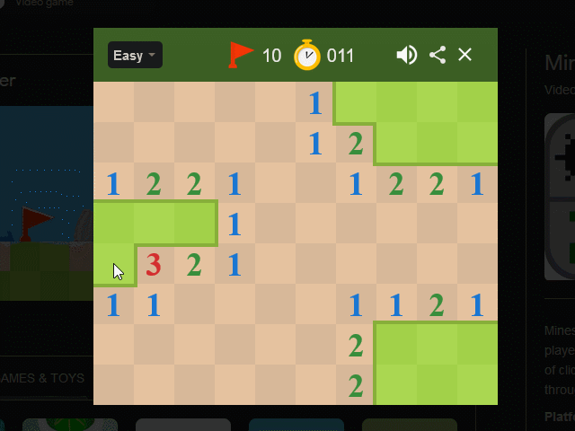

# Minesweeper-Bot

Bored of playing minesweeper yourself?!  
Say no more —  

  

## Dependencies

- [Google Tesseract OCR](https://github.com/tesseract-ocr/tesseract)
(I got the prebuilt binary package from [UB Mannheim](https://github.com/UB-Mannheim/tesseract/wiki))

## Installation
- download Tesseract OCR
- install dependencies with `pip install -r in requirements.txt`
- create a file `config.py` in the root directory
- in there create a variable `TESSERACT_EXE_PATH` with the path to your tesseract.exe (On Windows it could be in `C:\Users\User\AppData\Local\Tesseract-OCR\` or so)

## Usage
- open the google minesweeper mini game and keep it open (split screen or something)
- run the `sweep.py` script, it will (try to) recognize the game on the screen and start playing

